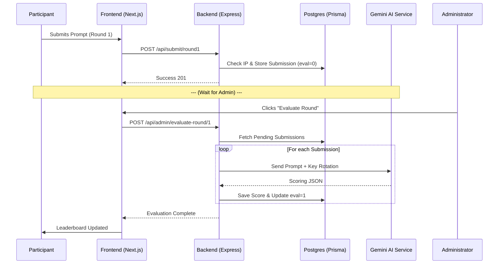

# 🌀 PROMPT WARS: Application Flow

This document outlines the end-to-end journey for both Participants and Administrators in the platform.

---

## 1. Participant Journey

### Phase A: Arrival & Preparation
1. **Landing Page**: Participants arrive at the "Star Wars" themed landing page and enter the **Command Center** (Dashboard).
2. **Dashboard**: They view the 3 rounds:
   - **Round 1 (Image)**: Active by default.
   - **Round 2 (Text)**: Locked (until Admin activates).
   - **Round 3 (Code)**: Hidden (until Admin reveals).

### Phase B: Submission
1. **Submission Modal**: Participant opens the Active round.
2. **Validation**: Zod cleanses the input (min length, valid URL/file).
3. **Anti-Spam**: System checks `req.ip` against previous submissions for that round.
4. **Transmission**: The payload is stored in PostgreSQL as `Pending`.

### Phase C: Results
1. **Real-time Leaderboard**: Once an admin evaluates the submission, the participant's score appears on the galactic leaderboard.

---

## 2. Admin Journey

### Phase A: Setup
1. **Seeding**: Admin uses the `/admin` dashboard to seed the database with Round definitions, names, and descriptions.

### Phase B: Controlling the Arena
1. **Activation**: Admin activates Round 2 when Round 1 ends. Round 1 is automatically locked.
2. **Revealing the Secret**: Admin triggers the "Secret Round 3" for final-level contenders.

### Phase C: Galactic Judging (AI)
1. **Sequential Evaluation**: Admin clicks "Evaluate Round" in the submissions tab.
2. **Key Rotation**: The backend picks an available Gemini API key.
3. **AI Scoring**: Gemini evaluates the prompt and output (Image interpretation or Text quality).
4. **Consistency**: JSON results are saved, and the submission is marked as `1/1 Evaluated`.

---

## 3. Data Architecture Flow (The "Sync")

